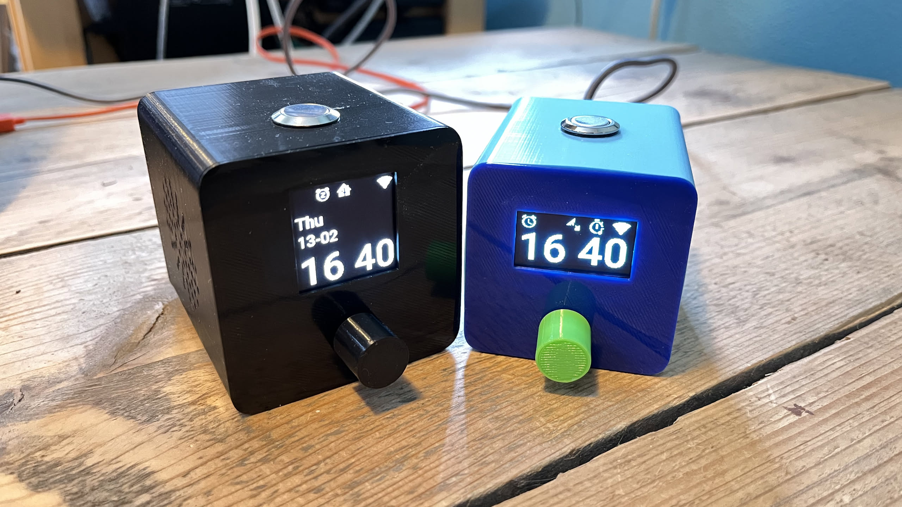

# [System Of Alarm Sound - A cheap full featured alarm clock](https://community.home-assistant.io/t/soas-full-featured-alarm-clock-with-home-assistant-integration/847108)

|                                                                     |                             |
|---------------------------------------------------------------------|-----------------------------|
|  |  |

* [What?](#What)
* [Why?](#Why)
* [Features](#Features)
	* [Optional Features](#OptionalFeatures)
* [Requirements](#Requirements)
* [Optional](#Optional)
* [Installation](#Installation)
	* [Modules](#Modules)
		* [ESP-IDF Framework](#ESP-IDFFramework)
		* [Arduino Framework](#ArduinoFramework)
		* [Audio Server (Optional)](#AudioServerOptional)
		* [GPS (Optional)](#GPSOptional)
		* [DS1307 (Optional)](#DS1307Optional)
		* [RTTTL (Optional)](#RTTTLOptional)
		* [GL5516 brightness sensor (Optional)](#GL5516brightnesssensorOptional)
* [Usage](#Usage)
* [Top button](#Topbutton)
	* [Top button short press](#Topbuttonshortpress)
	* [Top button double press](#Topbuttondoublepress)
	* [Top button triple press](#Topbuttontriplepress)
  * [Top button long press](#Topbuttonlongpress)
	* [Time page](#Timepage)
		* [Rotary single click](#Rotarysingleclick)
		* [Rotary double click](#Rotarydoubleclick)
		* [Rotary triple click](#Rotarytripleclick)
		* [Rotary Hold](#RotaryHold)
		* [Display](#Display)
	* [Alarm page](#Alarmpage)
		* [Rotary single click](#Rotarysingleclick-1)
		* [Rotary double click](#Rotarydoubleclick-1)
	* [Alarm volume page](#Alarmvolumepage)
	* [Home Assitant page 1,2,3 and 4](#HomeAssitantpage123and4)
		* [Rotary single click](#Rotarysingleclick-1)
		* [Rotary double click](#Rotarydoubleclick-1)
		* [Rotary triple click](#Rotarytripleclick-1)
	* [Sleep timer page](#Sleeptimerpage)
		* [Rotary single click](#Rotarysingleclick-1)
		* [Rotary double click](#Rotarydoubleclick-1)
	* [Radio page](#Radiopage)
	* [Volume and contrast pages](#Volumeandcontrastpages)
	* [Restart page](#Restartpage)
	* [Options not available on the alarm itself](#Optionsnotavailableonthealarmitself)
* [Display mode](#Displaymode)
* [Home Assistant SOAS version notification](#HomeAssistantSOASversionnotification)
* [FAQ](#FAQ)
	* [SH1107 SPI/I2C](#SH1107SPII2C)
* [Known issues](#Knownissues)
* [[Changelog]](#Changelog)

## <a name='What'></a>What?
ESPHome with Home Assistant integration?! "No shit, Sherlock". Well yes, all ESPHome has got HA integration, but SOAS has features that enables you to have HA automations based on your alarm time. So automations can be triggered based on the alarm time set on the alarm clock. There are 4 switches that will switch relative to the alarm time, you have the choice to enable the HA switch whether the alarm will sound or not. So the alarm does not have to sound for the HA automation to be triggered.

## <a name='Why'></a>Why?
This alarm clock is customizable, full featured and smart for under €25,-. It's a clock that can be managed through Home Assistant and (mostly) on the clock itself. The clock can be set while your partner is asleep, a tradional clock could be making noise. And, because of the smart features, you could for instance enable the heating in your home 15 minutes before the alarm sets off. Especially when your wake up schedule is not regular, this clock can make automations efficient by associating the triggers with your alarm time.

## <a name='Features'></a>Features
* Alarm based on time.
* Different display modes so there is more or less light emitted by the clock.
* Contrast based on day or night with smooth dimming
* 4 Home Assistant integrated switches that switch based on the alarm time, alarm does not have to sound. These switches can be switched manually on the clock itself.
* Customizable sleep timer.
* Customizable snooze timer.
* Online radio streams.
* Decent sound.
* Ability to hide the clock
* Volume increase of the alarm after a defined time of alarming
  - Start and / or end volume can be configured
* Ability to "Display on/off automatically"
  - Display is switched on when there is interaction or when alarm fires
  - Display is switched off when there has not been input for 10 seconds
  - It will not switch off when alarm_on, snooze_on or music_on


### <a name='OptionalFeatures'></a>Optional Features
* Time sync with GPS for when internet is not available
* Time backup with DS1307 rtc module internet is not available
* Local buzzer playback with service and as fallback when internet is not available
* Contrast based on brightness in the room
* Local file as fallback when internet is not available
  - Integrated in the ESP-IDF framework, but has stability issues
  - Audio server for the arduino framework, with the disadvantage that WiFi must have been connected for this to work

## <a name='Requirements'></a>Requirements
* < €25,-
* 3d printer (not included in the price)
* Dupont cables
* PLA
* Glue
* [ESP32-S3-N16R8](https://nl.aliexpress.com/item/1005006418608267.html) ~ €6,-
* Oled screen
  - [SH1106](https://nl.aliexpress.com/item/1005007253095259.html) (128x64) ~ €2,50
  - [SH1107](https://nl.aliexpress.com/item/1005005313150711.html) (128x128) ~ €6,-
* MAX98357a amplifier ~ €3,-
* [3W speaker (AIYIMA 4Ohm 3W)](https://nl.aliexpress.com/item/32593991938.html) ~ €3,-
* [Rotary button, EC11 W Half 20mm](https://nl.aliexpress.com/item/1005001877184897.html) < €1,-
* A button to be used on top of the clock, the following are supported:
  - [Flat head button, 16mm](https://nl.aliexpress.com/item/1005003400929705.html) ~ €1,50
  - [Micro tactile switch, 6x6x5](https://nl.aliexpress.com/item/1005004971266223.html) < 0,10 per piece

## <a name='Optional'></a>Optional

* A bit of soldering is not required, but the ground has to be shared so it is nice to solder those. Depending on your rotary button, you maybe also need to do a little bit of soldering
* [NEO-6M](https://nl.aliexpress.com/item/1005006816514975.html) ~3,- for GPS time sync, this link requires soldering
* [DS1307](https://de.aliexpress.com/item/1005006984190682.html) ~ €0,50/Pc
* [RTTTL buzzer](https://de.aliexpress.com/item/1005009658713423.html) ~ €0,16/Pc
* [GL5516 brightness sensor](https://de.aliexpress.com/item/4000098897360.html) ~ €0,35/10pcs. For additional parts needed, see: [GL5516 brightness sensor (Optional)](#GL5516Optional)
* Audio Server, to have local file support with the Arduino framework

## <a name='Installation'></a>Installation

3d print [these](https://www.thingiverse.com/thing:7091731) STL files.

Connect all dupont cables corresponding the schema's below:

| SH1106 / SH1107 | ESP32  |
|-----------------|--------|
| VCC             | 3v     |
| GND             | GND    |
| SCL             | GPIO47 |
| SDA             | GPIO48 |

| Rotary Button | ESP32  |
|---------------|--------|
| A             | GPIO9  |
| B             | GPIO10 |
| C             | GND    |
| D             | GND    |
| E             | GPIO8  |

| MAX98357a | ESP32   |
|-----------|---------|
| LRC       | GPIO12  |
| BLCK      | GPIO1   |
| DIN       | GPIO2   |
| GND       | GND     |
| Vin       | 5v / 3v |

| Top button | ESP32 |
|------------|-------|
| Switch     | GPIO4 |
| GND        | GND   |

If you are going to add optional modules. Please review those modules for additional overlapping PINs.

Include the config below in your YAML. This one is made for a `ESP32-S3-N16R8`. Take a look at the examples to view a complete yaml:

```yaml
substitutions:
  display_model: "SH1107 128x128" #use "SH1106 128x64" for SH1106
  display_rotation: "270" #use 0 for SH1106
  sun_latitude: 52.37°
  sun_longitude: 4.89°
  i2c_sda: GPIO48
  i2c_scl: GPIO47
  i2s_lrclk_pin: GPIO12
  i2s_bclk_pin: GPIO1
  i2s_dout_pin: GPIO2
  pin_a: GPIO9
  pin_b: GPIO10
  alarm_off_button_pin: GPIO4
  rotary_button_pin: GPIO8
  language: "EN" #NL and DE are also supported
  alarm_off_button_single_click_time: 1s #max time in seconds, which the alarm off button can be pressed to recognize the press
  timezone: Europe/Amsterdam

packages:
  remote_package_files:
    url: https://github.com/skons/soas
    files: [alarm-clock-soas.yaml] #Review the modules section!

time:
  - id: !extend ntp
    timezone: ${timezone}
    servers:
      - 0.pool.ntp.org
      - 1.pool.ntp.org
      - 2.pool.ntp.org

select:
  - id: !extend alarm_stream_url
    options:
      - "mp3 url to radio" #AAC seams to be making SOAS crash, FLAC or WAV will probably also work
      - "mp3 url to radio #2"
  - id: !extend alarm_stream_name
    options:
      - "Friendly name of the radio station"
      - "Friendly name of the radio station #2"

esphome:
  name: alarm-clock-soas
  friendly_name: Alarm Clock SOAS
  platformio_options: #PSRAM stuff
    build_flags: "-DBOARD_HAS_PSRAM"
    board_build.arduino.memory_type: qio_opi

psram:
  mode: octal
  speed: 80MHz
```

Save the `fonts` folder into your ESPHome folder. The folder needs to be placed in the same directory as your YAML.

Edit the `select` options with a stream URL and the name of the stream. To get some streams, install [radio browser](https://www.home-assistant.io/integrations/radio_browser/). Select a stream, send it to the clock and look at the ESPHome logging to view the URL of that stream.

Edit `alarm_file` to have your own local alarm. You can use mp3, wav or a flac file.

### <a name='Modules'></a>Modules

It is required that you choose the ESP-IDF or the Arduino module, all other modules are optional.

#### <a name='ESP-IDFFramework'></a>ESP-IDF Framework

The ESP-IDF framework provides a `media_player` component which allows for playing a local file, which is used when the configured stream does not play. The downside of this framework is that is has more issues playing a stream. Crashes can occur.

Edit the YAML and make sure the `packages` and `esp32` at least contains the code from below.

``` yaml
packages:
  remote_package_files:
    url: https://github.com/skons/soas
    files: [alarm-clock-soas.yaml, alarm-clock-espidf.yaml]

esp32:
  board: esp32-s3-devkitc-1
  framework:
    type: esp-idf
  flash_size: 16MB
```

Add this to the `substitutions:`

``` yaml
  alarm_file: alarm.flac
```

#### <a name='ArduinoFramework'></a>Arduino Framework

The Arduino framework provides a simpeler `media_player` component, so to have a fallback to a non internet stream you will need something like the Audio Server or RTTL buzzer. Another downside is that the `media_player` does not report errors the way the ESP-IDF framework reports errors. Therefor it's more difficult to detect if the stream is playing. With the `alarm_on_local_after_seconds` number it is possible to force the local alarm after the defined seconds, due to bad error reporting it is advised to use this number.

Edit the YAML and make sure the `packages` and `esp32` at least contains the code from below.

``` yaml
packages:
  remote_package_files:
    url: https://github.com/skons/soas
    files: [alarm-clock-soas.yaml, alarm-clock-arduino.yaml]

esp32:
  board: esp32-s3-devkitc-1
  framework:
    type: arduino
  flash_size: 16MB
```

#### <a name='AudioServerOptional'></a>Audio Server (Optional)

**Important: There are mixed results for this local alarm to function when wifi has not been connected. Sometimes alarm will sound if wifi has not been connected, but it's safe to assume that it does not work. To be safe, use the RTTTL nowifi module**

Created just for the Arduino framework to have a local file available when internet/wifi is down. This local file is for when internet is not available.

Add `webserver:`to you main yaml file.

Add this to the `substitutions:`

``` yaml
  alarm_file: alarm.flac
```

Add `alarm-clock-audio-server.yaml` to the `files:` property of `packages`.

#### <a name='GPSOptional'></a>GPS (Optional)

Instead of using internet time (NTP), it is possible to use GPS which does not require internet. The NEO-6M module is supported. Keep in mind that it's not the fastest method, it could take some time before the GPS sattelites have been found. It's accuracy is very high though. There is also an STL file available to attach this component to the case.

| NEO-6M | ESP32       |
|--------|-------------|
| TX     | GPIO44 (RX) |
| RX     | GPIO43 (TX) |
| VCC    | 3v          |
| GND    | GND         |

Add this to the `substitutions:`

``` yaml
  #NEO-6M
  gps_tx_pin: GPIO43
  gps_rx_pin: GPIO44
```

Add `alarm-clock-gps.yaml` to the `files:` property of `packages`.

#### <a name='DS1307Optional'></a>DS1307 (Optional)

With the DS1307 rtc module the clock keeps the time, also when the power is lost. There is also an STL file available to attach this component to the case.

**No recharge mod**

Those modules are usally designed to work with rechargeable LIR2032 batterys and on 5V only (DS1307 spec is 4,5V - 5,5V). You must modify the DS1307 module in order to work with non rechargable and cheap CR2032 coin cells and the 3V3 IIC of the ESP32. On some ESP32-S3 PCB's you have to bridge a jumper to get +5V on the ESP out pin! Meassure the voltage before connect it, it should be arround ~5V (sometimes 4,7 because there is a diode in series, which is ok).
[Pictures of modifications in images folder starting with ds1307_...](images/)

| DS1307   | ESP32  | Remarks                               |
|----------|--------|---------------------------------------|
| SCL      | GPIO47 | Shared with the display               |
| SDA      | GPIO48 | Shared with the display               |
| VCC      | 5V     | On some boards, this must be soldered |
| GND      | GND    |                                       |
| 3V3 wire | 3V3    | Only with no recharge mod             |


Add `alarm-clock-ds1307.yaml` to the `files:` property of `packages`.

#### <a name='RTTTLOptional'></a>RTTTL (Optional)

**Important: Only use the `alarm-clock-rtttl.yaml` module only in combination with the Arduino framework module. It overwrites the `alarm_on_local` functionality**

With an added buzzer, you can use this to play nostalgia RTTTL sound (like on older phones or pc system speaker). The main goal of this is to use it as a fallback when internet is down, or the music stream malfunctions. The ESP-IDF framework has got local file function, this module does not add any functionality in that case. Instead it overwrites the `alarm_on_local` functionality which removes the local file support.

The choice is between `alarm-clock-rtttl.yaml` or `alarm-clock-rtttl-nowifi.yaml`. Use the first if you do not have local file support (see Audio Server). Use the second if you use local file support, keep in mind that the RTTTL buzzer will only come in to play when the clock is coming back from power outage, but has not connected with wifi. If the wifi connection has taken place, the Audio Server will function and then the RTTTL buzzer is not needed.

| BUZZER | ESP32  |
|--------|--------|
| RED    | GPIO21 |
| BLACK  | GND    |

Add this to the `substitutions:`

``` yaml
  #RTTTL
  buzzer_pin: GPIO21
  buzzer_gain: 50%
```

If the buzzer_gain value does not work, you can add a 56 Ohm resistor in series to make it more quiet.

Add this to `select:` (after your stream urls)

``` yaml
    #buzzer sounds - do not use too much, this crash SOAS
  - id: !extend alarm_buzzer_sound
    options:
      - "Mario:d=4,o=5,b=100:16e6,16e6,32p,8e6,16c6,8e6,8g6,8p,8g,8p,8c6,16p,8g,16p,8e,16p,8a,8b,16a#,8a,16g.,16e6,16g6,8a6,16f6,8g6,8e6,16c6,16d6,8b,16p,8c6,16p,8g,16p,8e,16p,8a,8b,16a#,8a,16g.,16e6,16g6,8a6,16f6,8g6,8e6,16c6,16d6,8b,8p,16g6,16f#6,16f6,16d#6,16p,16e6,16p,16g#,16a,16c6,16p,16a,16c6,16d6,8p,16g6,16f#6,16f6,16d#6,16p,16e6,16p,16c7,16p,16c7,16c7,p,16g6,16f#6,16f6,16d#6,16p,16e6,16p,16g#,16a,16c6,16p,16a,16c6,16d6,8p,16d#6,8p,16d6,8p,16c6"
      - "The Simpsons:d=4,o=5,b=160:c.6,e6,f#6,8a6,g.6,e6,c6,8a,8f#,8f#,8f#,2g,8p,8p,8f#,8f#,8f#,8g,a#.,8c6,8c6,8c6,c6"
      - "Two short tones:d=4,o=5,b=100:16e6,16e6"
  - id: !extend alarm_buzzer_name
    options:
      - "Mario"
      - "The Simpsons"
      - "Two short tones"
```

For additional tunes, see `alarm-clock-rtttl-additional-tunes.txt`. You can add them instead of the above. Do not add too much, this can crash SOAS.

Add `alarm-clock-rtttl.yaml` or `alarm-clock-rtttl-nowifi.yaml` to the `files:` property of `packages`.

#### <a name='GL5516brightnesssensorOptional'></a>GL5516 brightness sensor (Optional)

With an added GL5516 LDR, the clock can adjust the display contrast automatically based on the room brightness.

For better performance it is recommend to add the following:
 - Capacitors: 2x 100nF , 1x 10µF & 1x 1µF
 - Resistors: 1x 10kOhm & 1x 100 Ohm

Please note:
I have not calibrated the sensor (schematic, placement, ...) nor done extensive research on this.
The lux value may not be accurate! In my case it shold just set the display contrast, based on room brightness.

The following schematic are "borrowed" from the Ulantzi TC001 clock:

```
3V3 - GL5516 ------- 10k ------- GND
|                |
10uF & 100nF     1uF & 100nF - GND
|                |
|                100 Ohm
|                |
GND              SENSE (ESP32 GPIO14)
```

Connect it to the ESP32:

| GL5516 | ESP32  |
|--------|--------|
| SENSE  | GPIO14 |
| GND    | GND    |
| 3V3    | 3V3    |

Here is a picture with the sensor installed:
[Picture of an installed GL5516](images/gl5516_ldr_installed.jpg)

It is recommend to use some clear plastic (in the picture a case of a clear furniture sticker is used) and allign the ldr inside.

Add this to the `substitutions:`

``` yaml
  #Add this for GL5516 LDR
  ldr_pin: GPIO14
  aab_min: 0            # minimal value for abb
  aab_max: 255          # maximal value for abb
  aab_add: 10           # add value for abb
  aab_scale: 2.5        # scale of abb [Picture of an installed GL5516](images/gl5516_ldr_installed)
  aab_offset: 0
```

You can adjust the above values to you liking. I found the above fit my needs (sensor, position in the room, ...) regarding auto-adjust brightness. A diagram for `aab_scale` value can be found here [aab_scale value diagram for GL5516](gl5516_ldr_scale_diagram.jpg)

Add `alarm-clock-gl5516.yaml` to the `files:` property of `packages`.

##### Usage

###### Test a tune

To test a tune, you can use the HA service "tune" to play directly on the buzzer of the device, like this example:

``` yaml
action: esphome.soas_tune
data:
  tune: Two short tones:d=4,o=5,b=100:16e6,16e6
```

## <a name='Usage'></a>Usage

The rotary button is the button for accessing and editing configuration. When on a page, and there is no blinking of a configuration, you will automatically be redirected to the time page after 5 seconds of inactivity. The edit mode, blinking of a configuration, needs to be exited to return back to the time page. Entering and exiting the edit mode is done by single clicking the rotary button.

## <a name='Topbutton'></a>Top button

### <a name='Topbuttonshortpress'></a>Top button short press

When the alarm, sleep timer and snooze are off, single press will switch the music on. If the sleep timer is enabled, the sleep timer will also switch to on.

If the music is on, the music will be switched off. If the sleep timer is also on, it will be reset and switched of.

When the alarm is on, snooze will switch on and the alarm will go to off.

When snooze is on, the snooze will be switched off on single press.

### <a name='Topbuttondoublepress'></a>Top button double press

When the alarm is on, you can switch to music playing. This is usefull when the local alarm kicks in but the music was working fine, this is certainly the case with `alarm_on_local_after_seconds`. If you have the sleep timer enabled, it will also switch on when the music switches on. The sleep timer does not switch on when a remote stream is sent to SOAS, by using the radio browser for instance.

### <a name='Topbuttontriplepress'></a>Top button triple press

Switch the alarm on, mainly for testing purposes.

### <a name='Topbuttonlongpress'></a>Top button long press

Just play the configured url. When the local alarm is sounding, you can switch to your streaming URL. If the music and alarm are off, you can enable streaming without the sleep timer on, if it is enabled.

### <a name='Timepage'></a>Time page

#### <a name='Rotarysingleclick'></a>Rotary single click
Single click of the rotary button toggles alarm enabled.

#### <a name='Rotarydoubleclick'></a>Rotary double click
Double click will bring you to the contrast page.

#### <a name='Rotarytripleclick'></a>Rotary triple click
Triple click will bring you to the volume page.

#### <a name='RotaryHold'></a>Rotary Hold
Holding and releasing the rotary button will bring you to the reboot page.

#### <a name='Display'></a>Display
Blinking of the alarm icon (most left icon) means that the music or alarm is on. There is a difference in icons so it's possible to see if the alarm is on, or if the music is playing. This happens when it is switched on manually or by the time set as alarm. When it is displayed, but not blinking it means the alarm is enabled. If the radio is on, the rotary button does not allow to switch pages but instead it will interact with the volume. If settings must be changed, the radio must be switched off.

The second icon is the snooze icon and tells you if snooze is on.

The Home Assistant icon is cut into 4 pieces. Left top is HA 1, right top is HA 2, left bottom is HA 3 and right bottom is HA 4. Is that part visible?, then that HA switch is enabled and it will go off relative to the alarm time. If it is blinking, then the HA switch is on. The on switch will be on for 1 minute and after that it will be automatically switched off.

Blinking of the sleep timer icon (second to last icon) means that the sleep timer is on. When it is displayed, but not blinking, the sleep timer is enabled.

The last icon is showing the wifi strength.

The SH1107 display contains more pixel space, therefor the day of the week and date is displayed. The alarm time is also displayed, if snooze is on, then the time when the alarm will sound is displayed.

### <a name='Alarmpage'></a>Alarm page

#### <a name='Rotarysingleclick-1'></a>Rotary single click
The alarm can be edited by single clicking the rotary button, the time that blinks is the one that is in edit mode. Single again and it will bring you to the minute. The last single click allows for editing the time it will take for the local alarm to be on. Keep in mind that you need to have local alarm support on your clock. Turning the rotary button is used to edit the hour, minute or alarm on local after seconds.

If the SH1106 is used, the alarm on local after seconds is only visible when the edit mode is beyond the editing of the minutes. On the sh1107 it all fits on the same page.

#### <a name='Rotarydoubleclick-1'></a>Rotary double click
Double click will enable or disable the alarm.

### <a name='Alarmvolumepage'></a>Alarm volume page

The Alarm volume page allows you to edit the volume that will be applied when the alarm goes off. The `Alarm volume increase duration` and `Alarm volume increase` should both be higher then 0 for this automatic volume to work. Enter edit mode with a rotary button single click, it will edit the following 4 respectively after each single click:

1. Alarm volume increase start - The volume applied when the alarm goes of. Set to 0 to have de default volume applied. Must always be lower or equal to the end volume.
2. Alarm volume increase end - The max volume that will be applied, if set tot 0 the max volume will be 100. Must always be equal or higher to the start volume.
3. Alarm volume increase - The volume that will be added each time the duration has passed.
4. Alarm volume increase duration - The duration it takes before an increase will be applied

When the SH1106 is used, the Alarm volume increase and Alarm volume increase duration is only visible when the edit mode reaches the Alarm volume increase item. On the SH1107 it all fits on the same page.

### <a name='HomeAssitantpage123and4'></a>Home Assitant page 1,2,3 and 4

This page display the time relative to the alarm time. The icons on the right show if the switch is enabled (top), and it show the alarmed switch (bottom). The first means that it will always triggers relative to the alarm time. If the alarmed switch is on, then the Home Assistant switch will only trigger if the alarm is enabled. If you want the Home Assistant switch to trigger, make sure the alarm time is set correctly. If you only want to enable the alarm when the alarm sound goes of, switch the alarmed switch to on.

#### <a name='Rotarysingleclick-1'></a>Rotary single click
Single click of the rotary button will enable editing of the relative time, the rotary button can then be used to change the time.

#### <a name='Rotarydoubleclick-1'></a>Rotary double click
Double click will toggle the Home Assistant enabled switch and alarmed switch. The enabled switch (right top icon) means the HA switch will switch on relative to the alarm time. The alarmed switch (right bottom icon) means that the switch is associated with the alarm being enabled. If HA is enabled, alarmed off, then the HA switch will switched based on the alarm time but the alarm does not have to be enabled. If HA is enabled and alarmed is switched on, then the HA switch will switch on only when the alarm is also enabled.

First double click will enable the enabled switch. The second double click will enable both enabled and alarmed switch. The third will disable both switches. Alarmed can only be enabled if the Home Assistant switch is enabled.

#### <a name='Rotarytripleclick-1'></a>Rotary triple click
Triple click will switch the Home Assistant switch to on. This way it is possible to trigger your Home Assistant automation anytime you want. Regardless of the enabled and alarmed switched, and regardless of the alarm time.

### <a name='Sleeptimerpage'></a>Sleep timer page

#### <a name='Rotarysingleclick-1'></a>Rotary single click
With a single click with the rotary button you can define how long the music will play until it will be switched off.

#### <a name='Rotarydoubleclick-1'></a>Rotary double click
Double click will enable or disable the sleep timer.

### <a name='Radiopage'></a>Radio page

Enter edit mode with a rotary button single click to select the station that will be used for the radio. Switching to a radio station means the radio will go on. Selecting the radio station will also switch the radio off.

### <a name='Volumeandcontrastpages'></a>Volume and contrast pages

The pages that are accessible from the time page are editable by rotating the rotary button. The contrast is depending on the day or night time. There is a different setting for both, and that can only be configured during that time.

### <a name='Restartpage'></a>Restart page

Use the rotary button to select the correct option, single click the rotary button to restart or cancel your action.

### <a name='Optionsnotavailableonthealarmitself'></a>Options not available on the alarm itself

A few options are not (yet) available on the alarm self:
* Snooze duration
* Display Mode
* Hide clock
* Night mode - This mode is enabled by the sun long lat by default. `Night mode automatically` switched off will not switch the mode without a Home Assistant automation

Use Home Assistant to configure these options. You can also enable the web server by adding `web_server:` to your yaml. This could have performance impact.

## <a name='Displaymode'></a>Display mode

There are 3 display modes:
* Full
* Minimum night only
* Minimum

The `Full` means that all is visible. The second indicator `:` will only blink during day time.

The `Minimum night only` will have a thinner font for less light. The wifi icon will not be displayed unless there is no wifi. The second indicator does not blink. This will only be displayed if the `night mode` switch is on.

`Minimum` is the same as `Minimum night only`, except that switching `night mode` on or off does not change the display.

## <a name='HomeAssistantSOASversionnotification'></a>Home Assistant SOAS version notification

If you want to be notified if there is an update for SOAS, you can add this to your Home Assistant configuration. Every SOAS clock provides its own version as entity to Home Assistant.

Add this in configuration. Make sure `ensor.alarm_clock_soas_soas_version` is correct, and replace `notify.mobile_app_iphone`.

``` yaml
rest_command:
  soas:
    url: https://raw.githubusercontent.com/Skons/SOAS/refs/heads/main/changelog.md
    method: GET

automation:
  - alias: "SOAS Version Check"
    id: soas_version_check
    initial_state: "on"
    mode: restart
    triggers:
      - trigger: time
        at: "12:34:56"
    action:
      - action: rest_command.soas
        response_variable: soas_response
      - if: "{{ soas_response['status'] == 200 }}"
        then:
          - alias: "Parse data"
            variables:
              version: "{{ (soas_response.content.split('##')[1]).split('\n')[0] }}"
              currentVersion: "{{ states('sensor.alarm_clock_soas_soas_version') }}"
          - if: "{{ version and version != currentVersion }}"
            then:
            - action: notify.mobile_app_iphone
              data:
                title: "Soas update"
                message: "SOAS has got an update with version {{ version }}"
```

## <a name='FAQ'></a>FAQ

### <a name='SH1107SPII2C'></a>SH1107 SPI/I2C

Some SH1107 display modules support both I2C and SPI interface modes (one mode at a time). To switch to IIC mode, follow [this](https://simple-circuit.com/interfacing-arduino-sh1107-oled-display-i2c-mode/) tutorial and review [this](https://github.com/Skons/SOAS/issues/2#issue-3286014273) post.

## <a name='Knownissues'></a>Known issues
* The ESP-IDF framework seems to be causing frequent crashes (https://github.com/esphome/esphome/issues/10451)
* The GPS module seems to be causing crashes, even if the ESP-IDF framework does not cause crashes

## <a name='Changelog'></a>[Changelog](changelog.md)
